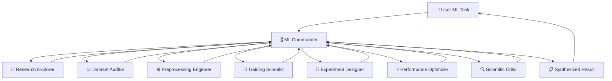
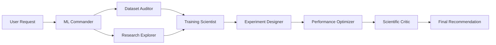
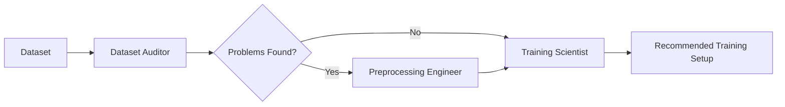
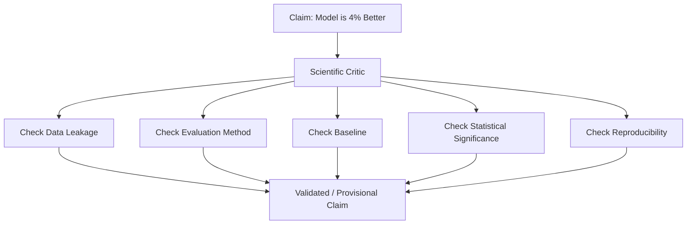
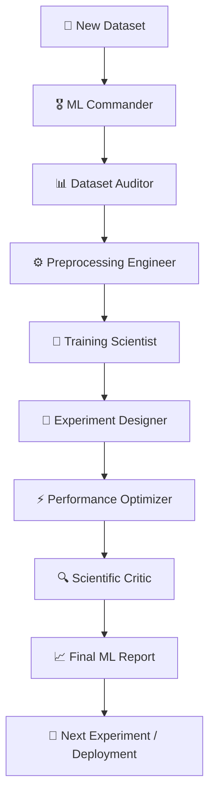
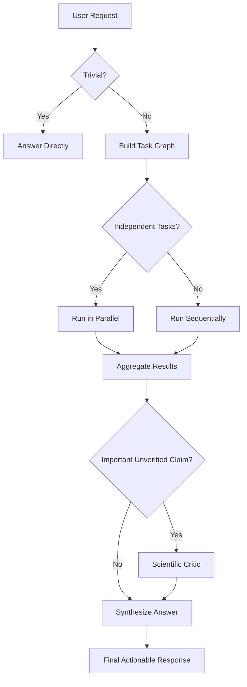

# 🤖 ML Agent Army

### Turn GitHub Copilot into a specialized AI team for Machine Learning

**ML Agent Army** is a multi-agent AI workflow designed to extend a general-purpose coding assistant into a **specialized Machine Learning engineering and research team**.

Instead of asking one AI agent to handle every ML problem, ML Agent Army uses a **Commander + Specialist Agents** architecture. The Commander understands the task, decides which specialists are required, runs independent tasks in parallel where possible, sequences dependent tasks, and finally combines the results into one actionable response.

> **One prompt → Multiple specialized agents → One coherent ML solution**

---

## 🚀 Why ML Agent Army?

A normal coding assistant is excellent for writing code, explaining errors, and answering general development questions.

But real-world ML work involves much more than writing code.

You may need to:

* Understand an unfamiliar research paper or repository
* Audit a dataset for quality problems
* Detect data leakage
* Design preprocessing and augmentation
* Select or improve a model architecture
* Tune training parameters
* Design meaningful experiments
* Benchmark CPU/GPU performance
* Evaluate whether an improvement is actually significant
* Review scientific claims
* Improve reproducibility

Doing all of this through a single generic assistant can lead to shallow or disconnected answers.

**ML Agent Army solves this by turning the assistant into a team of specialized ML experts.**

---

# 🧠 Architecture

The system follows a hierarchical multi-agent architecture.



### The Commander is the brain of the system.

The Commander does **not** try to perform every specialized task itself.

Instead, it:

1. Understands the user's request
2. Breaks the request into smaller tasks
3. Selects the appropriate specialists
4. Determines task dependencies
5. Runs independent tasks in parallel
6. Passes relevant results between agents
7. Resolves disagreements
8. Requests scientific review when necessary
9. Produces one final actionable response

This makes the workflow closer to working with an actual ML team.

---

# 👥 The Agent Army

| Agent                         | Primary Responsibility                                                |
| ----------------------------- | --------------------------------------------------------------------- |
| 🔬 **Research Explorer**      | Repositories, papers, SOTA research, architecture understanding       |
| 📊 **Dataset Auditor**        | Dataset quality, leakage, imbalance, labels                           |
| ⚙️ **Preprocessing Engineer** | Cleaning, transformations, augmentation, feature engineering          |
| 🧠 **Training Scientist**     | Architecture, training loops, optimizers, schedulers, hyperparameters |
| 🧪 **Experiment Designer**    | Baselines, ablations, experiment planning, statistical discipline     |
| ⚡ **Performance Optimizer**   | CPU/GPU, memory, throughput, inference and deployment optimization    |
| 🔍 **Scientific Critic**      | Adversarial review, reproducibility, leakage and claim validation     |

The current Commander definition explicitly routes substantial ML work across these specialist roles.

---

# 🔄 How It Works

A simple request might look like:

```text
"Improve the training performance of my image classification model."
```

Instead of immediately generating random training changes, the Commander can create a workflow such as:



### Why this matters

The order is important.

For example:

> Don't optimize the model before checking whether the dataset has leakage.

A model showing a 5% improvement may not actually be better if the evaluation setup is flawed.

The Agent Army therefore treats ML improvements as **provisional until important evidence has been checked**.

---

# ⚡ Parallel vs Sequential Work

One of the major advantages of the architecture is that the Commander can determine which tasks can happen simultaneously.

### Example

Suppose you ask:

> "Analyze this repository and suggest improvements to its training pipeline."

The system can perform:

```text
                    ML Commander
                         │
             ┌───────────┴───────────┐
             ↓                       ↓
      Research Explorer        Dataset Auditor
             │                       │
             └───────────┬───────────┘
                         ↓
                  Training Scientist
                         ↓
                  Experiment Designer
                         ↓
                  Scientific Critic
                         ↓
                    Final Answer
```

Research and dataset analysis are relatively independent, so they can happen in parallel.

Training recommendations depend on those findings, so they happen afterward.

---

# 🛠️ Installation

## 1. Clone the repository

```bash
git clone https://github.com/mrdebugger001/ML-AGENT-ARMY.git
cd ML-AGENT-ARMY
```

---

## 2. Open the project in VS Code

Open the repository using Visual Studio Code.

```bash
code .
```

---

## 3. Use the Agent Configuration

The main orchestration entry point is:

```text
ml-commander.agent.md
```

This defines the **ML Commander** and its specialist-agent workflow.

The repository also contains the packaged Agent Army:

```text
ml-agent-army.zip
```

---

# 💬 How to Use It

The best way to use ML Agent Army is to give the Commander a **real ML problem**, rather than asking a generic coding question.

For example:

```text
Audit this dataset before I train my model.
```

or:

```text
Analyze this training pipeline and find the biggest performance bottlenecks.
```

or:

```text
Improve this model's validation performance and design experiments to verify the improvements.
```

The Commander determines which specialists should be involved.

---

# 🎯 Practical Use Cases

## 1. Dataset Auditing

### Prompt

```text
Audit my dataset before training.

Check for:
- data leakage
- class imbalance
- duplicate samples
- suspicious labels
- train/validation contamination
- potential evaluation problems

Give me a prioritized list of issues.
```

### Workflow



---

# 🧹 2. Data Preprocessing

Use the Agent Army when you need help deciding how your raw data should be transformed.

### Prompt

```text
Design a preprocessing pipeline for this dataset.

Consider:
- normalization
- resizing
- augmentation
- missing values
- class imbalance
- feature engineering

Explain why each transformation is appropriate.
```

The **Preprocessing Engineer** focuses on designing the transformation pipeline while considering the characteristics of the dataset.

---

# 🧠 3. Model Development

You can use the army to analyze an existing architecture or design a new one.

### Prompt

```text
Analyze my current model architecture.

Identify:
1. architectural weaknesses
2. unnecessary complexity
3. likely bottlenecks
4. possible improvements
5. experiments I should run before changing the architecture
```

The Commander can route this to the **Training Scientist**, **Research Explorer**, and **Experiment Designer**.

---

# 🏋️ 4. Training Optimization

Instead of simply asking:

```text
"How can I increase accuracy?"
```

ask:

```text
Analyze my complete training pipeline.

Check:
- optimizer
- learning rate
- scheduler
- batch size
- regularization
- augmentation
- loss function
- validation strategy

Suggest changes and explain which experiments I should run first.
```

This allows the system to separate:

**Problem identification → Proposed change → Experiment → Validation**

rather than blindly changing hyperparameters.

---

# 🧪 5. Experiment Design

ML experiments become much more useful when you change **one meaningful variable at a time**.

### Example

```text
I changed my augmentation strategy and accuracy increased by 2%.

Design an experiment plan to determine whether this improvement is real.
```

The **Experiment Designer** can help establish:

```text
Baseline
   ↓
Controlled Change
   ↓
Repeated Runs
   ↓
Metric Comparison
   ↓
Statistical Analysis
   ↓
Conclusion
```

---

# ⚡ 6. Performance Optimization

For slow training or inference:

```text
Profile this ML pipeline conceptually.

Find likely CPU, GPU, memory and data-loading bottlenecks.

Prioritize optimizations by expected impact and implementation difficulty.
```

The **Performance Optimizer** focuses specifically on:

* GPU utilization
* CPU bottlenecks
* memory usage
* data loading
* training throughput
* inference speed
* deployment packaging

---

# 🔬 7. Research & Repository Understanding

Starting with an unfamiliar research repository?

Instead of manually reading everything:

```text
Explain this repository to me as if I need to extend it.

Identify:
- architecture
- data flow
- training pipeline
- important files
- model components
- dependencies
- where I should make changes
```

The **Research Explorer** is designed for repository and research understanding, including building learning paths from unfamiliar projects.

---

# 🔍 8. Scientific Criticism

This is one of the most important parts of the system.

Suppose you say:

```text
My new model is 4% better than the baseline.
```

Instead of accepting that statement immediately, the **Scientific Critic** can challenge it.



This helps prevent:

* accidental leakage
* weak baselines
* cherry-picked results
* misleading metrics
* irreproducible experiments

---

# 🌍 Specialized Domains

The architecture can also be used for specialized ML workflows.

For projects involving:

* Computer Vision
* Remote Sensing
* Multispectral imagery
* Hyperspectral imagery
* SAR
* PCB/AOI inspection
* Image classification
* Object detection
* Segmentation

the Commander can explicitly communicate the relevant domain context to the specialist handling the task.

---

# 🧩 Example: Complete ML Workflow

Imagine you have a new dataset and want to build a production-ready model.

You can give the Commander:

```text
I have a new image dataset.

I want to build a reliable classification model from it.

First audit the dataset, then recommend preprocessing,
design a baseline model, propose experiments,
optimize the training pipeline, and finally critically
review the results.
```

The resulting workflow can look like:



This is the core philosophy behind ML Agent Army:

> **Don't just generate code. Build a workflow around the problem.**

---

# 🧠 Commander Decision Logic

The Commander follows a routing strategy rather than blindly calling every agent.



The Commander is explicitly instructed to avoid unnecessary orchestration for trivial questions and to delegate substantial work to the appropriate specialist.

---

# 📋 Recommended Prompt Structure

You will generally get better results if your prompt contains four things:

```text
CONTEXT
What am I working on?

TASK
What do I want to accomplish?

CONSTRAINTS
What limitations or requirements exist?

EXPECTED OUTPUT
What should the Agent Army return?
```

### Example

```text
CONTEXT:
I am training a CNN for satellite image classification.

TASK:
Improve validation performance.

CONSTRAINTS:
I have limited GPU memory and cannot significantly
increase training time.

EXPECTED OUTPUT:
Identify the most likely bottlenecks, recommend
experiments in priority order, and explain how I
should validate each improvement.
```

---

# 🏗️ Project Structure

```text
ML-AGENT-ARMY/
│
├── .github/
│
├── ml-commander.agent.md
│
├── ml-agent-army.zip
│
└── README.md
```

### `ml-commander.agent.md`

The central orchestration definition.

It contains:

* Commander role
* Agent roster
* Routing logic
* Delegation rules
* Evidence requirements
* Failure handling
* Handoff rules
* ML-specific safeguards

The current repository exposes this file as the main Commander definition.

---

# 🔐 Evidence-First ML

A core principle of ML Agent Army is:

> **An improvement is not automatically a valid scientific result.**

The system preserves distinctions between:

```text
Observed
   ↓
Inferred
   ↓
Hypothesized
   ↓
Unknown
```

This is particularly important when multiple agents contribute different pieces of evidence.

The Commander is instructed to preserve these evidence labels rather than presenting uncertain findings as established facts.

---

# ⚠️ Failure Handling

If a specialist cannot perform its assigned task, the Commander should **not silently pretend that the task was completed**.

Instead, the system should:

1. Identify the unavailable specialist/tool
2. Explain the limitation
3. Reduce the scope if possible
4. Clearly label the reduced-scope result
5. Ask for additional input when necessary

This keeps the workflow transparent and avoids fabricated results.

---

# 🎯 Design Philosophy

ML Agent Army is built around five principles:

### 1. Specialization

Different ML problems require different expertise.

### 2. Orchestration

A Commander coordinates the specialists instead of trying to do everything.

### 3. Parallelism

Independent investigations should run simultaneously whenever possible.

### 4. Evidence

Important conclusions should be supported and challenged before being treated as reliable.

### 5. Practicality

The final output should help you decide **what to do next**, not simply produce a wall of information.

---

# 🚀 From AI Assistant to AI Team

Traditional workflow:

```text
Developer
    ↓
General AI Assistant
    ↓
Answer
```

ML Agent Army:

```text
Developer
    ↓
ML Commander
    ↓
┌─────────┬──────────┬────────────┐
│ Research│ Dataset  │ Training   │
│         │ Audit    │            │
├─────────┼──────────┼────────────┤
│ Preproc │ Experiments │ Perf.   │
│         │             │ Optimize │
└─────────┴──────────┴────────────┘
              ↓
       Scientific Critic
              ↓
       Synthesized Answer
```

The goal isn't to replace the developer.

The goal is to give the developer a **specialized AI team that can reason about different parts of the ML workflow together.**

---

# 💡 What Can You Build With It?

ML Agent Army can be adapted for workflows such as:

* 📊 Dataset analysis
* 🧹 Data preprocessing
* 🧠 Model development
* 🏋️ Training optimization
* 🧪 Experiment planning
* 🔬 Research exploration
* ⚡ Performance optimization
* 🔍 Scientific review
* 📈 Benchmark analysis
* 👁️ Computer Vision workflows
* 🛰️ Remote Sensing workflows
* 🏭 Industrial inspection / AOI workflows

The architecture is intentionally modular, so additional specialist agents can be added as your workflow evolves.

---

# 🛣️ Future Roadmap

Potential future extensions include:

* [ ] Automated experiment tracking
* [ ] ML experiment memory
* [ ] Dataset profiling automation
* [ ] Automated benchmark generation
* [ ] Model comparison agent
* [ ] Deployment specialist
* [ ] MLOps specialist
* [ ] Literature monitoring agent
* [ ] Automated experiment reports
* [ ] Integration with experiment-tracking platforms
* [ ] Persistent project-level ML memory

---

# 🤝 Contributing

Ideas, improvements, and new specialist agents are welcome.

If you have a repetitive ML workflow that could benefit from an AI specialist, consider contributing a new agent.

A useful specialist should have:

```text
Clear responsibility
        ↓
Defined inputs
        ↓
Defined outputs
        ↓
Evidence-aware reasoning
        ↓
Easy integration with Commander
```

---

# ⭐ Philosophy

> **Don't build one AI that tries to know everything.**
>
> **Build a team of AIs that each know what they are responsible for.**

ML Agent Army is my attempt to turn a general-purpose coding assistant into a **personalized ML engineering and research team**.

---

## 🔗 Repository

**ML Agent Army**

https://github.com/mrdebugger001/ML-AGENT-ARMY

If you find the project useful, ⭐ **star the repository** and feel free to experiment with your own specialist agents.

---

## 📜 License

Add your preferred open-source license here.

---

### Built for people who want to spend less time orchestrating ML work — and more time actually doing ML.
